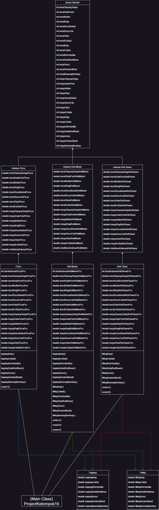

# PROJECT PERHITUNGAN TOKO ROTI PEMROGRAMAN BERORIENTASI OBJEK
Repository ini dibuat untuk menuntaskan tugas UAS PBO 2022 dengan kelompok beranggotakan :

Danang Kurniawan                  (K3521016) 
Ondihon Simanjuntak               (K3521058) 
Hakiki Al Qorni                   (K3521032) 
Kevin Alexander Josa Sudarmono    (K3521076) 
 
<h1>Diagram Class</h1>
 

